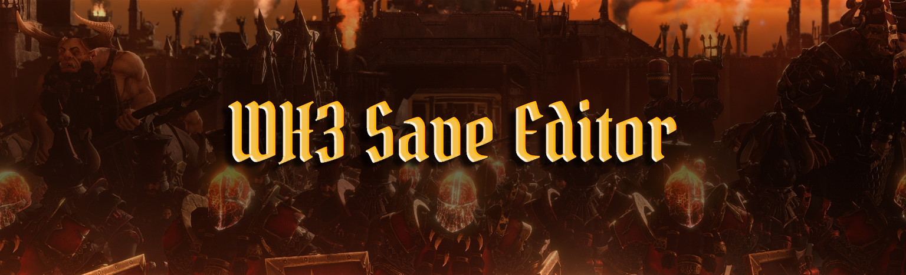
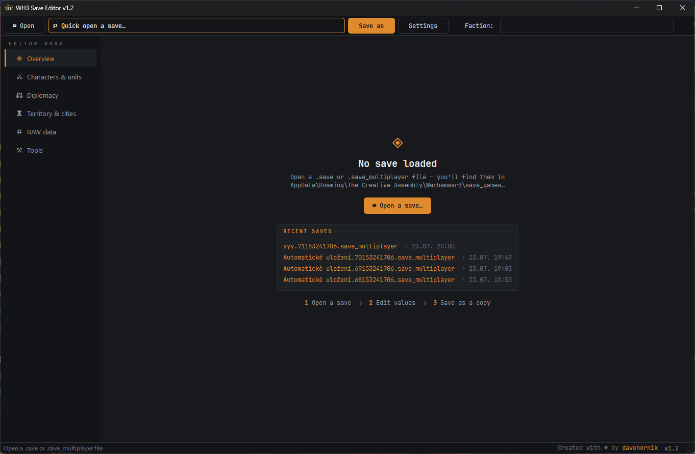
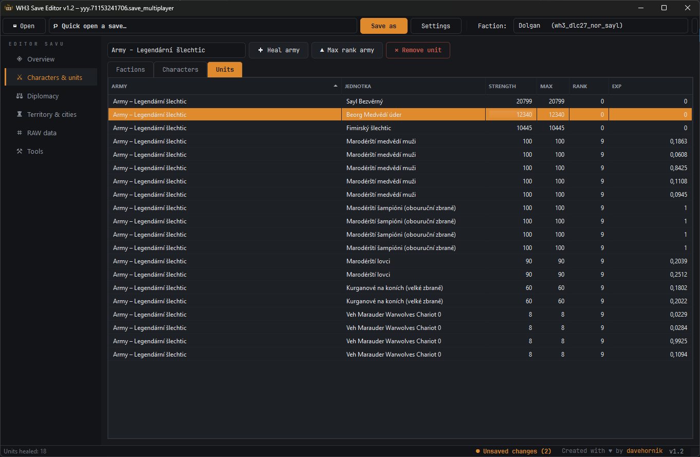
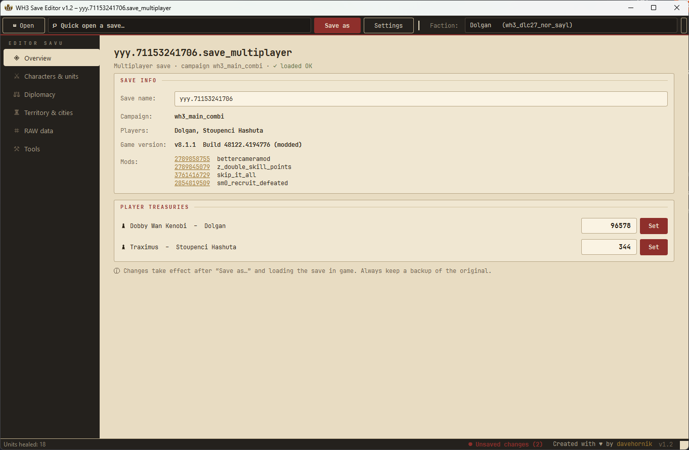
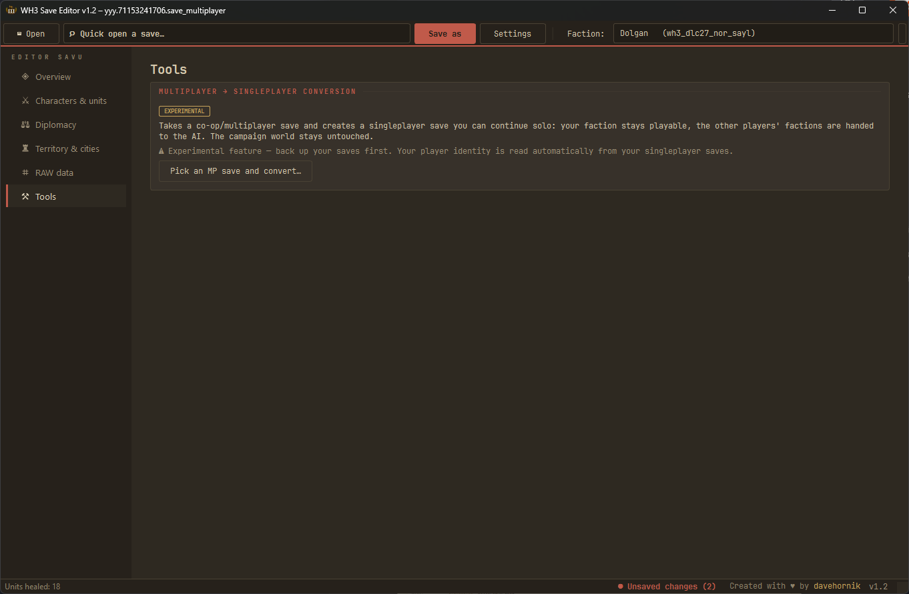

A savegame editor for **Total War: WARHAMMER III** — supports both **singleplayer** (`.save`) and **multiplayer** (`.save_multiplayer`) campaign saves.

## Features

- Opens, edits and re-saves WH3 campaign saves (ESF `0xABCB` format with LZMA-compressed campaign data)
- **Multiplayer → Singleplayer conversion** — continue any co-op campaign solo! Pick your co-op save, choose which player to continue as, and the tool creates a regular singleplayer save: your faction stays playable, your partners' factions are handed to the AI, the campaign world stays untouched. Works with 2+ player campaigns, older-patch saves, and both host and client copies — no mod required, nothing installed into the game
- **Readable names everywhere** — characters, factions, units and settlements show their real in-game names (resolved from your game's localisation packs), not `wh3_dlc27_nor_sayl` keys
- **Overview** — rename your save, see campaign, game version, mod list with Steam Workshop links, and edit player treasuries in one click
- **Factions** — all factions with editable treasury
- **Characters** — lords & heroes including the recruitment pool: rank, XP and unspent skill points (all editable), with role detection (army / hero / caravan / garrison / recruit pool)
- **Units** — every unit of every army: strength, max size, rank, experience (editable), grouped and filterable by army — plus one-click **Heal army**, **Max rank army** and **Remove unit**
- **Diplomacy** — relations between any two factions: war / peace / alliances via a color-coded picker, treaties (non-aggression pact, trade rights, military access) and experimental vassal/master editing
- **RAW data** — full lazy tree of the entire save (28M+ nodes) for advanced edits
- **5 UI themes** — Obsidian & Amber, Forge, Parchment & Seal, Dark Parchment, Blood Throne — switchable live in Settings, plus compact/airy table density
- English & Czech UI, quick-open list of your recent saves, guided first-run setup, built-in update notification
- Verified in game: money, XP, ranks, skill points, unit strength, save renaming and MP→SP conversion all survive loading and re-saving

 

(Since I am taking names from game language, I didn't bother changing mine for screenshots to EN from CZ)

## Download & first run

1. Download `WH3SaveEditor.exe` from the [latest release](https://github.com/davehornik/WH3SaveEditor/releases/latest)
2. Run it — pick your language; the app finds your save folders automatically
3. Edit, hit *Save as…*, load it in the game

> [!IMPORTANT]
> **Always keep a backup of your original save.** The editor never overwrites your files on its own (*Save as…* creates a copy), but a backup costs nothing and saves campaigns.

## Windows SmartScreen / antivirus warning

> [!WARNING]
> This app is **not code-signed** (certificates cost money), so Windows SmartScreen may show *"Windows protected your PC"* — click **More info → Run anyway**. Some antiviruses occasionally flag PyInstaller-packed executables as false positives — the original SaveParser had the same issue.

**Don't want to trust a random .exe?** Totally fair — message me and I'll send you the full source code so you can review it and build it yourself (plain Python + PySide6, single PyInstaller command).

## Compatibility

- Total War: WARHAMMER III, tested on patch 8.1.x (Immortal Empires), singleplayer and multiplayer saves
- Older-patch saves (ESF `0xABCA`) load and convert fine — verified on campaigns back to WH3 6.0

## Credits & inspiration

- **[SaveParser](https://sourceforge.net/projects/saveparser/)** by [RoninX](https://sourceforge.net/u/roninx2807/profile/) — the original savegame editor for older Total War titles that inspired this tool (WH3 was never supported there)
- **[EditSF fork by xADDBx](https://github.com/xADDBx/EditSF)** — first public editor supporting the WH3 `ABCB` codec
- **[RPFM](https://github.com/Frodo45127/rpfm)** by Frodo45127 — reference implementation of the ESF format
- Thanks to the Total War modding community for keeping the format knowledge alive

  
# Roadmap

> [!NOTE]
> Plans and ideas for future versions. No promises, no dates — this is a hobby project. 🙂
> Have a feature request? Open an issue!

## Next up (v1.3)

- [ ] **Territory & cities** — regions, provinces, buildings and garrisons: view & edit owners, building slots, construction progress
- [ ] **Save doctor** — structural validation of a save (detects truncated/corrupted files and says exactly where), plus diagnostics for the most common "corrupted save" causes: missing mods and game version mismatch (both are stored in the save header)
- [ ] **Patch guard** — warn when a save comes from a newer game version than the editor was tested on

## Planned

- [ ] **Character respec** — reset spent skills and refund skill points
- [ ] **Save diff** — compare two saves and show what changed (also useful for repairing a broken save from a healthy autosave)
- [ ] **Search in RAW tree** — find nodes and values in the full save structure
- [ ] **Singleplayer → Multiplayer conversion** — the other direction: bring a friend into your solo campaign

## Ideas / maybe someday

- [ ] Adding new units to armies (needs cracking the save's unit-ID counter)
- [ ] Editing of array values and coordinates (e.g. teleporting armies)
- [ ] Diplomacy extras: reputation/treachery cleanup, war coordination targets
- [ ] More UI languages (translations are simple JSON files — contributions welcome)
- [ ] Code-signed releases (no more SmartScreen warning)
- [ ] Publishing the full source code

## Done

- [x] **v1.2** *(includes everything planned for v1.1 — it was tested so quickly that both versions shipped as one release)* — **Multiplayer → Singleplayer conversion** (continue co-op campaigns solo, verified across campaigns, patches, player counts and host/client copies), **readable in-game names** for characters/factions/units/settlements, **5 UI themes** with live switching and table density options, army tools (heal / max rank / remove unit), converted-save naming, update notification, and fixes: rare *"decompressed size mismatch"* load failure (~1–2 % of saves), save-folder detection for SP-only players, max rank no longer touches lords/heroes
- [x] **v1.0** — first public release: faction treasuries, characters (rank / XP / skill points), units (strength / rank / experience), diplomacy (relations & treaties, experimental vassals), save renaming, mod list with Workshop links, RAW tree editor, EN/CZ interface, verified in game on WH3 8.1.x (singleplayer & multiplayer saves)

  
## Legal

Unofficial fan tool, not endorsed by SEGA, Creative Assembly or Games Workshop. *Total War: WARHAMMER* is their property. Use at your own risk — always back up your saves.
